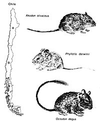

---
title       : Developing Data Products 
subtitle    : Course Project
author      : Bryan
job         : Big Science
framework   : io2012        # {io2012, html5slides, shower, dzslides, ...}
highlighter : highlight.js  # {highlight.js, prettify, highlight}
hitheme     : tomorrow      # 
widgets     : []            # {mathjax, quiz, bootstrap}
mode        : selfcontained # {standalone, draft}
knit        : slidify::knit2slides

--- .class #id2 

## Slide 2: Background Information



Since 1989 we have conducted monthly censuses of the small mammals (mostly rodents but there is one marsupial) in Fray Jorge National Park (North-Central Chile).  This area has highly variable rainfall and this influences the population sizes.  In this project we create an interactive graph to display the population trends of the most common species.
<br>
<br>
Population sizes are estimated with capture-mark-recapture techniques on 0.56 ha (75m x 75m) trapping grids.  Population size is expressed as animals per 0.56ha.

--- .class #id

## Slide 3: An example of R code in a Slidify Presentation

Population sizes are highly variable.  Here is a summary For three common species.
<br>
- AB: *Abrocoma bennetti* is always rare
- OD: *Octodon degus* is always present but variable in numbers
- OL: *Oligoryzomys longicaudatus* is only present following rainy years
```{r popSummary, include=TRUE, echo=FALSE, cache=TRUE}
 mnka<-read.csv(url('https://raw.github.com/willbmisled/datasciencecoursera/master/DDPproject/FJmnka.csv'))
 summary(mnka[,c(4,8,9)])
```

--- .class #id4 

## Slide 4: The Shiny App

To learn more about these species check out our shiny app. This app allows you to select a species of interest and to plot the monthly population sizes over time.  Follow the link below to see the app.

<a href="https://willbmisled.shinyapps.io/DDPproject/">Checkout the Shiny App</a>

--- .class #id5 
## Slide 5:  Links to the R code used for this project

All of the r scripts and markdown files used for this project are avaialable on gitHub.  The links below will take you there.

<a href="https://github.com/willbmisled/datasciencecoursera/tree/master/DDPproject">Github Repository with the code</a>

<a href="https://github.com/willbmisled/datasciencecoursera/blob/master/DDPslidify/index.Rmd">The Rmarkdown file used to create this slidify presentation</a>

<a href="https://github.com/willbmisled/datasciencecoursera/blob/master/DDPproject/ui.R">R code for the Shiny App User Interface</a>

<a href="https://github.com/willbmisled/datasciencecoursera/blob/master/DDPproject/server.R">R code for The Shiny App Server</a>

<a href="mnka<-read.csv(url('https://raw.github.com/willbmisled/datasciencecoursera/master/DDPproject/FJmnka.csv'))">A csv file with the data used to create the figures</a>


